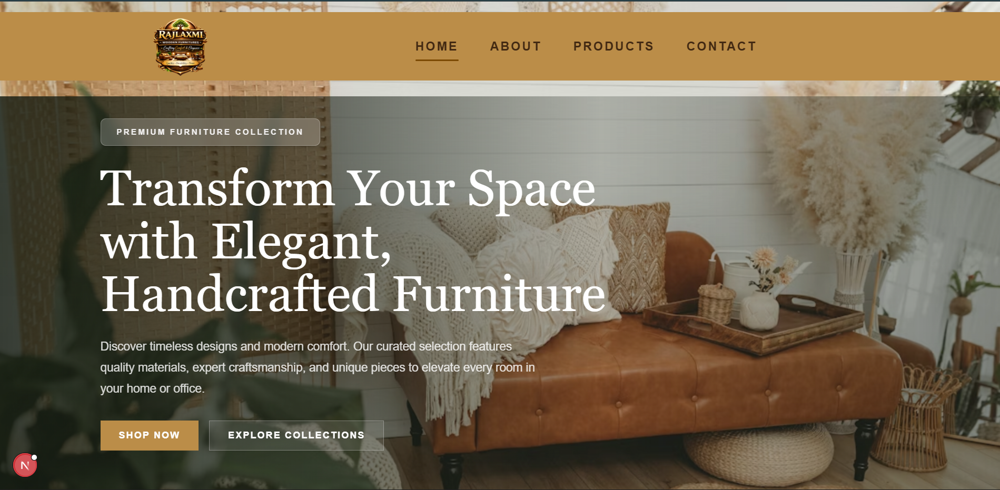

# Rajlaxmi Wooden Furnitures

Official Next.js storefront for Rajlaxmi Wooden Furnitures — showcases product catalog, services, and a contact system for enquiries. Built with performance and accessibility in mind.



## Highlights
- Responsive, mobile-first UI with image optimization
- Product listing and detail pages
- Contact / enquiry form with client-side validation
- Smooth UI animations using `framer-motion`

## Tech stack
- Next.js 16 (app router)
- React 19
- TypeScript (project typings included)
- Tailwind CSS + PostCSS
- Framer Motion for animations

## Prerequisites
- Node.js 18+ (recommended)
- npm (or pnpm / yarn)

## Get started (local development)
Clone the repository, install dependencies and run the dev server:

```bash
git clone <repo-url>
cd Rajlaxmi-Wooden-Furnitures
npm install
npm run dev
# Open http://localhost:3000
```

Available npm scripts (from `package.json`):

- `npm run dev` — start development server
- `npm run build` — build production artifacts
- `npm start` — start production server (after build)
- `npm run lint` — run ESLint

## Environment variables
Create a `.env.local` at the project root for runtime values. Example:

```
# .env.local
NEXT_PUBLIC_API_URL=https://api.example.com
```

## Project structure (overview)
- `app/` — Next.js routes and page layouts (home, about, contact, products, services)
- `components/` — UI components (Navbar, Footer, Product cards, Hero, LoadingScreen)
- `public/` — Static assets (images, svg, video)
- `styles/` or `globals.css` — Global styles + Tailwind entry

Notable components:
- `components/Navbar.tsx` — top navigation
- `components/Footer.tsx` — footer with contact links
- `components/LoadingScreen.tsx` — app loading state

## Coding conventions
- TypeScript for safer refactors
- ESLint with `eslint-config-next` for linting rules
- Tailwind utility classes for styling

## Build & deployment
Recommended: Deploy to Vercel for zero-config Next.js hosting. Steps:

1. Push repository to GitHub.
2. Create a new project in Vercel and connect the repo.
3. Set environment variables in the Vercel dashboard (e.g., `NEXT_PUBLIC_API_URL`).
4. Deploy — Vercel will run `npm run build` automatically.

You can also build locally with:

```bash
npm run build
npm start
```

## Testing & quality
- Run `npm run lint` and fix any issues reported by ESLint.
- Add unit or integration tests as needed (not included by default).

## Contributing
- Create an issue for bugs or feature requests.
- Fork the repo and open a pull request with a clear description.
- Follow the existing component structure and keep changes focused.

## License
This project is provided under the MIT License. See the `LICENSE` file.

## Maintainer
For questions or collaboration, contact: hello@example.com

---
If you'd like, I can add CI badges, a demo GIF, or adapt this README for `Orake` or `Swiftrise`.
